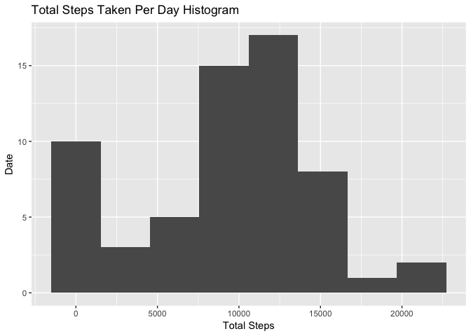

# Reproducible Research: Peer Assessment 1

## Load Packages

```r
  library(tidyverse)
  library(lubridate)
  library(scales)
```

## Loading and preprocessing the data
Set our working directory and the read in the `activity.csv` file provided by the instructor.  
Then create a new datetime column that will be used for analysis  


```r
setwd('/Users/oskipper/Documents/Data Science/DSAccelerator/SecondPhase/Coursera/ReproducibleResearch/Project1/RepData_PeerAssessment1/')
rd <- read.csv('activity.csv')

# Create a datetime column
rd1 <- rd %>% 
  mutate(date = as.Date(date)) %>% 
  mutate(year = year(date)) %>% 
  mutate(month = month(date)) %>% 
  mutate(day = day(date)) %>% 
  mutate(hour = interval %/% 100) %>% 
  mutate(minute = interval %% 100) %>% 
  mutate(datetime = make_datetime(year, month, day, hour, minute))
```

## Steps Taken Per Day
Create a generic df that gives us the number steps taken per day (any NA value will just be counted as 0 with this method)

```r
steps_per_day <- rd1 %>% 
  group_by(date) %>% 
  summarise(totalSteps = sum(steps, na.rm = TRUE))
```

Make a Histogram From the `steps_per_day` data frame

```r
steps_per_day %>% 
  ggplot(aes(x = date, y = totalSteps)) +
  geom_histogram(stat = "identity") + 
  ggtitle("Total Steps Taken Per Day") +
  xlab("Total Steps") + 
  ylab("Date")
```

```
## Warning: Ignoring unknown parameters: binwidth, bins, pad
```

<!-- -->

Calculate the mean and median steps for each day

```r
mean_steps = mean(steps_per_day$totalSteps)
median_steps = median(steps_per_day$totalSteps)

paste('Mean Steps: ', round(mean_steps, 2))
```

```
## [1] "Mean Steps:  9354.23"
```

```r
paste('Median Steps: ', round(median_steps, 2))
```

```
## [1] "Median Steps:  10395"
```

## What is the average daily activity pattern?

Create a df with average steps by day

```r
# Set it so all data looks like it's on Jan 1
avg_steps_interval <- rd1 %>% 
  mutate(time_of_day = update(datetime, month = 1, day = 1)) %>% 
  group_by(time_of_day) %>% 
  summarise(avg_steps = mean(steps, na.rm = TRUE))
```

Plot the data frame we just made

```r
  avg_steps_interval %>% 
  ggplot(aes(x = time_of_day, y = avg_steps)) +
  geom_line() +
  ggtitle("Average Steps Per Day By Time Of Day")+
  xlab("Time Of Day") +
  ylab("Avg Steps") +
  scale_x_datetime(labels = date_format("%H:00"))
```

<!-- -->

Find out which interval has the most steps on average:

```r
avg_steps_interval %>% 
  arrange(desc(avg_steps))
```

```
## # A tibble: 288 x 2
##            time_of_day avg_steps
##                 <dttm>     <dbl>
##  1 2012-01-01 08:35:00  206.1698
##  2 2012-01-01 08:40:00  195.9245
##  3 2012-01-01 08:50:00  183.3962
##  4 2012-01-01 08:45:00  179.5660
##  5 2012-01-01 08:30:00  177.3019
##  6 2012-01-01 08:20:00  171.1509
##  7 2012-01-01 08:55:00  167.0189
##  8 2012-01-01 08:15:00  157.5283
##  9 2012-01-01 08:25:00  155.3962
## 10 2012-01-01 09:00:00  143.4528
## # ... with 278 more rows
```
8:35 am has the highest number of average steps at 206 


## Imputing missing values

How many missing values are there?

```r
total_observations <- rd1 %>% 
  count()

na_observations <- rd1 %>% 
  filter(is.na(steps)) %>% 
  count()

paste('Total Observations: ', total_observations)
```

```
## [1] "Total Observations:  17568"
```

```r
paste('NA Observations: ', na_observations)
```

```
## [1] "NA Observations:  2304"
```

Strategy To Replace NAs: Get average number of steps for interval for that day, replace NAs with that average. If no data exists for that time frame on any day then it will default to 0.

```r
avg_day_interval <- rd1 %>% 
  mutate(week_day = wday(datetime)) %>% 
  group_by(interval, week_day) %>% 
  summarise(avg_steps = mean(steps, na.rm = TRUE))

# Join in avg_steps on interval/week_day & replace if values are NA

rd_imputted <-
  rd1 %>% 
  mutate(week_day = wday(datetime)) %>% 
  left_join(avg_day_interval, by = c('interval', 'week_day')) %>% 
  mutate(steps = ifelse(is.na(steps), avg_steps, steps))
```
Now plot & calculate mean/median for new dataset using same code from above
Create a generic df that gives us the number steps taken per day for imputted data

```r
steps_per_day_imputted <- rd_imputted %>% 
  group_by(date) %>% 
  summarise(totalSteps = sum(steps, na.rm = TRUE))
```

Make a Histogram From the `steps_per_day_imputted` data frame

```r
steps_per_day_imputted %>% 
  ggplot(aes(x = date, y = totalSteps)) +
  geom_histogram(stat = "identity") + 
  ggtitle("Total Steps Taken Per Day") +
  xlab("Total Steps") + 
  ylab("Date")
```

```
## Warning: Ignoring unknown parameters: binwidth, bins, pad
```

<!-- -->

Calculate the mean and median steps for each day

```r
mean_steps_imputted = mean(steps_per_day_imputted$totalSteps)
median_steps_imputted = median(steps_per_day$totalSteps)

paste('Mean Steps Imputted: ', round(mean_steps_imputted, 2))
```

```
## [1] "Mean Steps Imputted:  10821.21"
```

```r
paste('Mean Steps: ', round(mean_steps, 2))
```

```
## [1] "Mean Steps:  9354.23"
```

```r
paste('Median Steps Imputted: ', round(median_steps_imputted, 2))
```

```
## [1] "Median Steps Imputted:  10395"
```

```r
paste('Median Steps: ', round(median_steps, 2))
```

```
## [1] "Median Steps:  10395"
```

Imputting the data has increased the observed mean value. This means that the observations that were NA were filled in on average with higher values - so they were missing from parts of the day that when observed the subject took more steps than on average.
The median value did not change.


## Are there differences in activity patterns between weekdays and weekends?


```r
# Set it so all data looks like it's on Jan 1 (just to get clean times for a single day)
rd_imputted %>% 
  mutate(type_of_day = ifelse(weekdays(date) %in% c("Saturday", "Sunday"), "weekend", "weekday")) %>% 
  mutate(time_of_day = update(datetime, month = 1, day = 1)) %>% 
  group_by(type_of_day, time_of_day) %>% 
  summarise(avg_steps = mean(steps)) %>% 
  ggplot(aes(x = time_of_day, y = avg_steps)) +
  geom_line() +
  facet_grid(.~type_of_day) +
  ggtitle("Average Steps Per Day Weekday vs Weekend") +
  xlab("Time of Day") +
  ylab("Average Steps") +
  scale_x_datetime(labels = date_format("%H:00"))
```

<!-- -->

